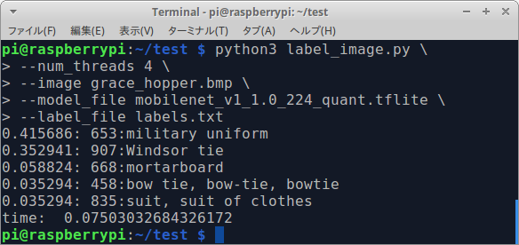
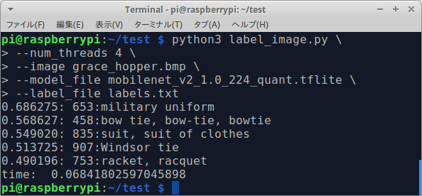
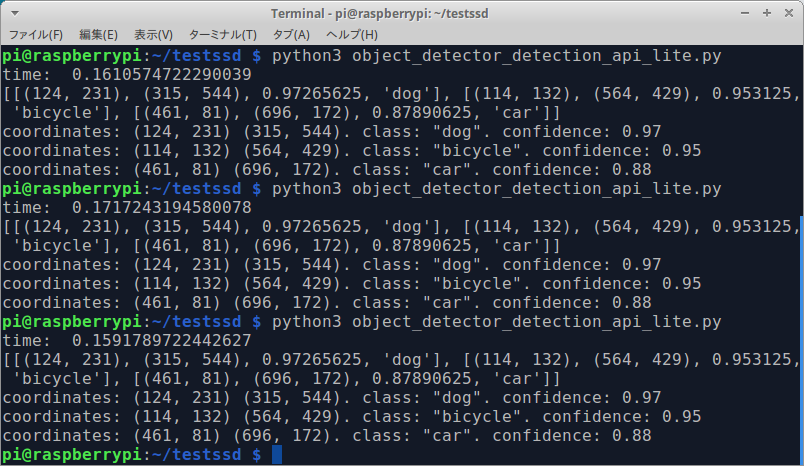
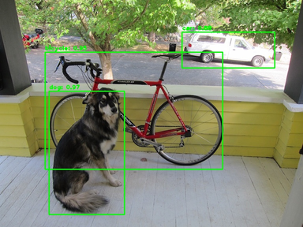
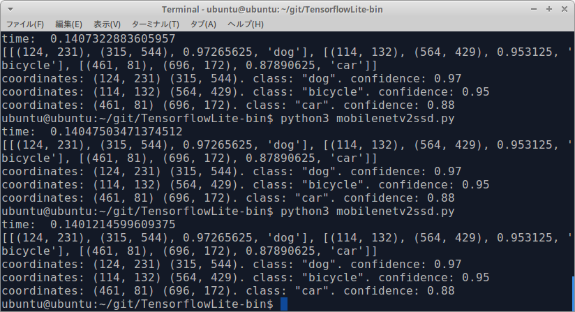

# TensorflowLite-bin
Prebuilt binary for TensorflowLite's standalone installer. For RaspberryPi.
I provide a **`FlexDelegate`**, **`MediaPipe Custom OP`**, **`XNNPACK`** and **`XNNPACK Multi-Thread PythonAPI`** enabled binary.

Here is the Tensorflow's official **[README](https://github.com/tensorflow/tensorflow/tree/master/tensorflow/lite/tools/pip_package)**.

If you want the best performance with RaspberryPi4/3, install Ubuntu 18.04+ aarch64 (64bit) instead of Raspbian armv7l (32bit). The official Tensorflow Lite is performance tuned for aarch64. On aarch64 OS, performance is about 4 times higher than on armv7l OS.
**[How to install Ubuntu 19.10 aarch64 (64bit) on RaspberryPi4 - Qiita - PINTO](https://qiita.com/PINTO/items/adc5db7af7a5996c0f72)**

The full build package for Tensorflow can be found **[here (Tensorflow-bin)](https://github.com/PINTO0309/Tensorflow-bin.git)**.

TensorFlow Lite will continue to have TensorFlow Lite builtin ops optimized for mobile and embedded devices. However, TensorFlow Lite models can now use a subset of TensorFlow ops when TFLite builtin ops are not sufficient.
**1. [TensorflowLite-flexdelegate (Tensorflow Select Ops) - Github - PINTO0309](https://github.com/PINTO0309/TensorflowLite-flexdelegate.git)**
**2. [Select TensorFlow operators to use in TensorFlow Lite](https://www.tensorflow.org/lite/guide/ops_select)**

A repository that shares tuning results of trained models generated by Tensorflow. Post-training quantization (Weight Quantization, Integer Quantization, Full Integer Quantization), Quantization-aware training.
**[PINTO_model_zoo - Github - PINTO0309](https://github.com/PINTO0309/PINTO_model_zoo.git)**

## Reference articles
- My article. **[Tensorflow Lite v1.14.0 / v1.15.0-rc0 armhf (armv7l) is tuned for MultiThread acceleration and cross-compiled for RaspberryPi on Ubuntu](https://qiita.com/PINTO/items/961010e38aa77fb6269b)**

- Please refer to the following URL for details of performance. **[Post-training quantization with TF2.0 Keras - nb.o’s Diary](https://nextremer-nbo.blogspot.com/2019/10/tf20keraspost-training-quantization.html?m=1)**. The performance evaluation article was created by **[@Nextremer_nb_o
](https://mobile.twitter.com/Nextremer_nb_o)** / **[Github](https://github.com/NobuoTsukamoto)**. Thank you.

- **[[Japanese ver.] [Tensorflow Lite] Various Neural Network Model quantization methods for Tensorflow Lite (Weight Quantization, Integer Quantization, Full Integer Quantization, Float16 Quantization, EdgeTPU). As of May 05, 2020.](https://qiita.com/PINTO/items/008c54536fca690e0572)**

- **[[English ver.] [Tensorflow Lite] Various Neural Network Model quantization methods for Tensorflow Lite (Weight Quantization, Integer Quantization, Full Integer Quantization, Float16 Quantization, EdgeTPU). As of May 05, 2020.](https://qiita.com/PINTO/items/865250ee23a15339d556)**

- **[A standalone 2MB installer for TensorflowLite v2.4.0-rc4 and a libedgetpu.so.1 build intended to run on a Yocto-generated environment](https://qiita.com/PINTO/items/effb80ee349d8db6af1b)**

- **[Add a custom OP to the TFLite runtime to build the whl installer (for Python)](https://zenn.dev/pinto0309/articles/a0e40c2817f2ee)**, **`MaxPoolingWithArgmax2D`**, **`MaxUnpooling2D`**, **`Convolution2DTransposeBias`**

## Python API packages

|Device|OS|Distribution|Architecture|Python ver|Note|
|:--|:--|:--|:--|:--|:--|
|RaspberryPi3/4|Raspbian/Debian|Stretch|armhf / armv7l|3.5|32bit|
|RaspberryPi3/4|Raspbian/Debian|Stretch|aarch64 / armv8|3.5|64bit|
|RaspberryPi3/4|Raspbian/Debian|Buster|armhf / armv7l|3.7 / 2.7|32bit|
|RaspberryPi3/4|Raspbian/Debian|Buster|aarch64 / armv8|3.7 / 2.7|64bit|
|RaspberryPi3/4|Ubuntu 20.04|Focal|armhf / armv7l|3.8|32bit|
|RaspberryPi3/4|Ubuntu 20.04|Focal|aarch64 / armv8|3.8|64bit|
|RaspberryPi3/4|Ubuntu 21.04/Debian/RaspberryPiOS|Hirsute/Bullseye|armhf / armv7l|3.9|32bit|
|RaspberryPi3/4|Ubuntu 21.04/Debian/RaspberryPiOS|Hirsute/Bullseye|aarch64 / armv8|3.9|64bit|
|RaspberryPi3/4|Ubuntu 22.04|Jammy|armhf / armv7l|3.10|32bit|
|RaspberryPi3/4|Ubuntu 22.04|Jammy|aarch64 / armv8|3.10|64bit|

## Usage
**Python3.7 - Buster**
```bash
$ sudo apt install -y \
swig libjpeg-dev zlib1g-dev python3-dev \
unzip wget python3-pip curl git cmake make
$ sudo pip3 install numpy==1.22.3
$ curl -OL https://github.com/PINTO0309/TensorflowLite-bin/releases/download/v2.9.0/tflite_runtime-2.9.0-cp37-none-linux_armv7l.whl
$ sudo pip3 install --upgrade tflite_runtime-2.9.0-cp37-none-linux_armv7l.whl
```
**Python3.9 - Bullseye**
```bash
$ sudo apt install -y \
swig libjpeg-dev zlib1g-dev python3-dev \
unzip wget python3-pip curl git cmake make
$ sudo pip3 install numpy==1.22.3
$ curl -OL https://github.com/PINTO0309/TensorflowLite-bin/releases/download/v2.9.0/tflite_runtime-2.9.0-cp39-none-linux_aarch64.whl
$ sudo pip3 install --upgrade tflite_runtime-2.9.0-cp39-none-linux_aarch64.whl
```

## Note
Unlike tensorflow this will be installed to a tflite_runtime namespace.
You can then use the Tensorflow Lite interpreter as.
```python
from tflite_runtime.interpreter import Interpreter
### Tensorflow v2.2.0
interpreter = Interpreter(model_path="foo.tflite")
### Tensorflow v2.3.0+
interpreter = Interpreter(model_path="foo.tflite", num_threads=4)
```
## Build parameter
### **1. Tensorflow v2.2.0 version or earlier**
```bash
cd tensorflow/tensorflow/lite/tools/pip_package
make BASE_IMAGE=debian:stretch PYTHON=python3 TENSORFLOW_TARGET=rpi BUILD_DEB=y docker-build
make BASE_IMAGE=debian:buster PYTHON=python3 TENSORFLOW_TARGET=rpi BUILD_DEB=y docker-build
make BASE_IMAGE=debian:stretch PYTHON=python3 TENSORFLOW_TARGET=aarch64 BUILD_DEB=y docker-build
make BASE_IMAGE=debian:buster PYTHON=python3 TENSORFLOW_TARGET=aarch64 BUILD_DEB=y docker-build
make BASE_IMAGE=ubuntu:18.04 PYTHON=python3 TENSORFLOW_TARGET=aarch64 BUILD_DEB=y docker-build
make BASE_IMAGE=ubuntu:18.04 PYTHON=python3 TENSORFLOW_TARGET=rpi BUILD_DEB=y docker-build
```
### **2. Tensorflow v2.3.0 version or later**
- git clone
```bash
git clone -b v2.9.0 https://github.com/tensorflow/tensorflow.git
cd tensorflow
```
- Apply customization to add custom operations for MediaPipe. (max_pool_argmax, max_unpooling, transpose_conv_bias, TransformLandmarks, TransformTensorBilinear, Landmarks2TransformMatrix)
```
curl -L -o tensorflow/tools/ci_build/Dockerfile.pi-python37 \
https://github.com/tensorflow/tensorflow/raw/v2.8.0/tensorflow/tools/ci_build/Dockerfile.pi-python37

curl -L -o tensorflow/tools/ci_build/Dockerfile.pi-python38 \
https://github.com/tensorflow/tensorflow/raw/v2.8.0/tensorflow/tools/ci_build/Dockerfile.pi-python38

curl -L -o tensorflow/tools/ci_build/Dockerfile.pi-python39 \
https://github.com/tensorflow/tensorflow/raw/v2.8.0/tensorflow/tools/ci_build/Dockerfile.pi-python39

curl -OL https://github.com/PINTO0309/TensorflowLite-bin/releases/download/v2.9.0/mediapipe_customop_patch.zip
unzip -d mediapipe_customop_patch mediapipe_customop_patch.zip
git apply mediapipe_customop_patch/*
```

- Added FlexDelegate and XNNPACK as build options. If you want to keep the binary size as small as possible, change `tflite_pip_with_flex` and `tflite_with_xnnpack` to `false` and build.
```bash
nano tensorflow/lite/tools/pip_package/build_pip_package_with_bazel.sh

# Build python interpreter_wrapper.
cd "${BUILD_DIR}"
case "${TENSORFLOW_TARGET}" in
  armhf)
    BAZEL_FLAGS="--config=elinux_armhf
      --copt=-march=armv7-a --copt=-mfpu=neon-vfpv4
      --copt=-O3 --copt=-fno-tree-pre --copt=-fpermissive
      --define tensorflow_mkldnn_contraction_kernel=0
      --define=raspberry_pi_with_neon=true"
    ;;
  aarch64)
    BAZEL_FLAGS="--config=elinux_aarch64
      --define tensorflow_mkldnn_contraction_kernel=0
      --copt=-O3"
    ;;
  native)
    BAZEL_FLAGS="--copt=-O3 --copt=-march=native"
    ;;
  *)
    BAZEL_FLAGS="--copt=-O3"
    ;;
esac

　↓

# Build python interpreter_wrapper.
cd "${BUILD_DIR}"
case "${TENSORFLOW_TARGET}" in
  armhf)
    BAZEL_FLAGS="--config=elinux_armhf
      --copt=-march=armv7-a --copt=-mfpu=neon-vfpv4
      --copt=-O3 --copt=-fno-tree-pre --copt=-fpermissive
      --define tensorflow_mkldnn_contraction_kernel=0
      --define=raspberry_pi_with_neon=true
      --define=tflite_pip_with_flex=true
      --define=tflite_with_xnnpack=false"
    ;;
  aarch64)
    BAZEL_FLAGS="--config=elinux_aarch64
      --define tensorflow_mkldnn_contraction_kernel=0
      --define=tflite_pip_with_flex=true
      --define=tflite_with_xnnpack=true
      --copt=-O3"
    ;;
  native)
    BAZEL_FLAGS="--copt=-O3 --copt=-march=native
      --define=tflite_pip_with_flex=true
      --define=tflite_with_xnnpack=true"
    ;;
  *)
    BAZEL_FLAGS="--copt=-O3
      --define=tflite_pip_with_flex=true
      --define=tflite_with_xnnpack=true"
    ;;
esac
```
- Build
```bash
### Common task
sed -i -e 's/FROM ubuntu:16.04/FROM ubuntu:18.04/g' tensorflow/tools/ci_build/Dockerfile.pi-python37
sed -i -e 's/FROM ubuntu:16.04/FROM ubuntu:18.04/g' tensorflow/tools/ci_build/Dockerfile.pi-python38
sed -i -e 's/FROM ubuntu:16.04/FROM ubuntu:18.04/g' tensorflow/tools/ci_build/Dockerfile.pi-python39
sed -i '5a ENV DEBIAN_FRONTEND=noninteractive' tensorflow/tools/ci_build/Dockerfile.pi-python39
sed -i '30a apt-get update && apt-get install -y dirmngr' tensorflow/tools/ci_build/install/install_deb_packages.sh
sed -i -e 's/xenial/bionic/g' tensorflow/tools/ci_build/install/install_pi_python3x_toolchain.sh

### Python 3.7 - TensorFlow v2.10.0 or later will not build.
sudo CI_DOCKER_EXTRA_PARAMS="-e CI_BUILD_PYTHON=python3.7 -e CROSSTOOL_PYTHON_INCLUDE_PATH=/usr/include/python3.7" \
  tensorflow/tools/ci_build/ci_build.sh PI-PYTHON37 \
  tensorflow/lite/tools/pip_package/build_pip_package_with_bazel.sh aarch64

sudo CI_DOCKER_EXTRA_PARAMS="-e CI_BUILD_PYTHON=python3.7 -e CROSSTOOL_PYTHON_INCLUDE_PATH=/usr/include/python3.7" \
  tensorflow/tools/ci_build/ci_build.sh PI-PYTHON37 \
  tensorflow/lite/tools/pip_package/build_pip_package_with_bazel.sh armhf

### Python 3.8
sudo CI_DOCKER_EXTRA_PARAMS="-e CI_BUILD_PYTHON=python3.8 -e CROSSTOOL_PYTHON_INCLUDE_PATH=/usr/include/python3.8" \
  tensorflow/tools/ci_build/ci_build.sh PI-PYTHON38 \
  tensorflow/lite/tools/pip_package/build_pip_package_with_bazel.sh aarch64

sudo CI_DOCKER_EXTRA_PARAMS="-e CI_BUILD_PYTHON=python3.8 -e CROSSTOOL_PYTHON_INCLUDE_PATH=/usr/include/python3.8" \
  tensorflow/tools/ci_build/ci_build.sh PI-PYTHON38 \
  tensorflow/lite/tools/pip_package/build_pip_package_with_bazel.sh armhf

### Python 3.9
sed -i '19a sudo pip3 install setuptools==60.7.0' tensorflow/tools/ci_build/install/install_auditwheel.sh
sed -i '20a sudo pip3 install numpy==1.22.3' tensorflow/tools/ci_build/install/install_auditwheel.sh

sudo CI_DOCKER_EXTRA_PARAMS="-e CI_BUILD_PYTHON=python3.9 -e CROSSTOOL_PYTHON_INCLUDE_PATH=/usr/include/python3.9" \
  tensorflow/tools/ci_build/ci_build.sh PI-PYTHON39 \
  tensorflow/lite/tools/pip_package/build_pip_package_with_bazel.sh aarch64

sudo CI_DOCKER_EXTRA_PARAMS="-e CI_BUILD_PYTHON=python3.9 -e CROSSTOOL_PYTHON_INCLUDE_PATH=/usr/include/python3.9" \
  tensorflow/tools/ci_build/ci_build.sh PI-PYTHON39 \
  tensorflow/lite/tools/pip_package/build_pip_package_with_bazel.sh armhf

### Python 3.10
#### aarch64
cp tensorflow/tools/ci_build/Dockerfile.pi-python39 tensorflow/tools/ci_build/Dockerfile.pi-python310
sed -i -e 's/3.9/3.10/g' tensorflow/tools/ci_build/Dockerfile.pi-python310
sed -i '19a sudo pip3 install setuptools==60.7.0' tensorflow/tools/ci_build/install/install_auditwheel.sh
sed -i '20a sudo pip3 install numpy==1.22.3' tensorflow/tools/ci_build/install/install_auditwheel.sh

sudo CI_DOCKER_EXTRA_PARAMS="-e CI_BUILD_PYTHON=python3.10 -e CROSSTOOL_PYTHON_INCLUDE_PATH=/usr/include/python3.10" \
  tensorflow/tools/ci_build/ci_build.sh PI-PYTHON310 \
  tensorflow/lite/tools/pip_package/build_pip_package_with_bazel.sh aarch64

#### armhf
cp tensorflow/tools/ci_build/Dockerfile.pi-python39 tensorflow/tools/ci_build/Dockerfile.pi-python310
sed -i -e 's/3.9/3.10/g' tensorflow/tools/ci_build/Dockerfile.pi-python310
sed -i '19a sudo pip3 install setuptools==60.7.0' tensorflow/tools/ci_build/install/install_auditwheel.sh
sed -i '20a sudo pip3 install numpy==1.22.3' tensorflow/tools/ci_build/install/install_auditwheel.sh
sed -i -e 's/FROM ubuntu:18.04/FROM ubuntu:20.04/g' tensorflow/tools/ci_build/Dockerfile.pi-python310

sudo CI_DOCKER_EXTRA_PARAMS="-e CI_BUILD_PYTHON=python3.10 -e CROSSTOOL_PYTHON_INCLUDE_PATH=/usr/include/python3.10" \
  tensorflow/tools/ci_build/ci_build.sh PI-PYTHON310 \
  tensorflow/lite/tools/pip_package/build_pip_package_with_bazel.sh armhf
```
## Operation check 【Classification】
**Sample of MultiThread x4 by Tensorflow Lite [MobileNetV1 / 75ms]**


**Sample of MultiThread x4 by Tensorflow Lite [MobileNetV2 / 68ms]**


- **Environmental preparation**
```bash
$ cd ~;mkdir test
$ curl https://raw.githubusercontent.com/tensorflow/tensorflow/master/tensorflow/lite/examples/label_image/testdata/grace_hopper.bmp > ~/test/grace_hopper.bmp
$ curl https://storage.googleapis.com/download.tensorflow.org/models/mobilenet_v1_1.0_224_frozen.tgz | tar xzv -C ~/test mobilenet_v1_1.0_224/labels.txt
$ mv ~/test/mobilenet_v1_1.0_224/labels.txt ~/test/
$ curl http://download.tensorflow.org/models/mobilenet_v1_2018_02_22/mobilenet_v1_1.0_224_quant.tgz | tar xzv -C ~/test
$ cd ~/test
```
- **label_image.py**
```python
import argparse
import numpy as np
import time

from PIL import Image

from tflite_runtime.interpreter import Interpreter

def load_labels(filename):
  my_labels = []
  input_file = open(filename, 'r')
  for l in input_file:
    my_labels.append(l.strip())
  return my_labels
if __name__ == "__main__":
  floating_model = False
  parser = argparse.ArgumentParser()
  parser.add_argument(
    "-i",
    "--image",
    default="/tmp/grace_hopper.bmp", \
    help="image to be classified"
  )
  parser.add_argument(
    "-m",
    "--model_file", \
    default="/tmp/mobilenet_v1_1.0_224_quant.tflite", \
    help=".tflite model to be executed"
  )
  parser.add_argument(
    "-l",
    "--label_file",
    default="/tmp/labels.txt", \
    help="name of file containing labels"
  )
  parser.add_argument(
    "--input_mean",
    default=127.5,
    help="input_mean"
  )
  parser.add_argument(
    "--input_std",
    default=127.5, \
    help="input standard deviation"
  )
  parser.add_argument(
    "--num_threads",
    default=1,
    help="number of threads"
  )
  args = parser.parse_args()

  interpreter = Interpreter(
    model_path="foo.tflite",
    num_threads=args.num_threads
  )
  try:
    interpreter.allocate_tensors()
  except:
    pass
  input_details = interpreter.get_input_details()
  output_details = interpreter.get_output_details()
  # check the type of the input tensor
  if input_details[0]['dtype'] == np.float32:
    floating_model = True
  # NxHxWxC, H:1, W:2
  height = input_details[0]['shape'][1]
  width = input_details[0]['shape'][2]
  img = Image.open(args.image)
  img = img.resize((width, height))
  # add N dim
  input_data = np.expand_dims(img, axis=0)
  if floating_model:
    input_data = (np.float32(input_data) - args.input_mean) / args.input_std

  interpreter.set_tensor(input_details[0]['index'], input_data)

  start_time = time.time()
  interpreter.invoke()
  stop_time = time.time()

  output_data = interpreter.get_tensor(output_details[0]['index'])
  results = np.squeeze(output_data)
  top_k = results.argsort()[-5:][::-1]
  labels = load_labels(args.label_file)
  for i in top_k:
    if floating_model:
      print('{0:08.6f}'.format(float(results[i]))+":", labels[i])
    else:
      print('{0:08.6f}'.format(float(results[i]/255.0))+":", labels[i])

  print("time: ", stop_time - start_time)
```
- **Inference test**
```bash
$ python3 label_image.py \
--num_threads 4 \
--image grace_hopper.bmp \
--model_file mobilenet_v1_1.0_224_quant.tflite \
--label_file labels.txt
```

## Operation check 【ObjectDetection】
### Sample of MultiThread x4 by Tensorflow Lite + Raspbian Buster (armhf) + RaspberryPi3 [MobileNetV2-SSD / 160ms]


### Sample of MultiThread x4 by Tensorflow Lite + Ubuntu18.04 (aarch64) + RaspberryPi3 [MobileNetV2-SSD / 140ms]


## Inference test
```bash
$ python3 mobilenetv2ssd.py
```
### MobileNetV2-SSD (UINT8) + Corei7 CPU only + USB Camera + 10 Threads + Async


### MobileNetV2-SSDLite (UINT8) + RaspberryPi4 CPU only + USB Camera 640x480 + 4 Threads + Sync + Disp 1080p


## List of quantized models
**https://www.tensorflow.org/lite/guide/hosted_models**

## Other MobileNetV1 weight files
**https://github.com/tensorflow/models/blob/master/research/slim/nets/mobilenet_v1.md**

## Other MobileNetV2 weight files
**https://github.com/tensorflow/models/blob/master/research/slim/nets/mobilenet/README.md**

## Reference
**tflite only python package https://github.com/PINTO0309/Tensorflow-bin/issues/15**
**Incorrect predictions of Mobilenet_V2 https://github.com/tensorflow/tensorflow/issues/31229#issuecomment-527296093**

